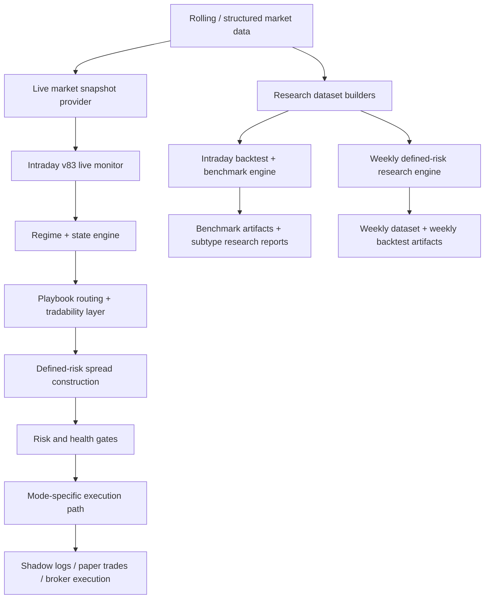

# NIFTY AI Trading Engine: Current Architecture and Business Logic

Last updated: 2026-05-10

## 1. Scope and current source of truth

This document is the current architecture and business-logic reference for the active engine in this repository.

It covers:
- the current intraday defined-risk engine under `/Users/Rohit/AI-Trading-Engine/data_engine/market_ai/intraday_defined_risk`
- the current weekly research-only engine under `/Users/Rohit/AI-Trading-Engine/data_engine/market_ai/weekly_defined_risk`
- the operational runtime, health, reconciliation, paper-mode learning layer, datasets, and artifacts

Important:
- The old top-level `README.md` still describes an older weekly theta workflow and is not the full source of truth for the current intraday v83 stack.
- The current approved live candidate is the frozen `v83` intraday bearish engine.
- Weekly defined-risk logic is research-only.

## 2. Current approved system posture

### Intraday v83

Validated benchmark artifact:
- `/Users/Rohit/AI-Trading-Engine/data_engine/market_ai/state/intraday_post_tuesday_expiry_benchmark_2026-04-12_v83.json`

Current approved benchmark metrics:
- trades: 10
- wins: 10
- losses: 0
- realized P&L: Rs 25,303.12
- strategy used: `BEAR_CALL_CREDIT_SPREAD`
- playbook distribution:
  - `SIDEWAYS_TO_BEARISH_REJECTION`: 7
  - `GAP_DOWN_BEARISH_CONTINUATION`: 2
  - `GAP_UP_BEARISH_FAILURE`: 1

Current runtime configuration artifact:
- `/Users/Rohit/AI-Trading-Engine/data_engine/market_ai/state/intraday_v83_runtime_config.json`

Current approved live/paper rules:
- mode currently configured as `PAPER_LIVE`
- live playbooks enabled:
  - `SIDEWAYS_TO_BEARISH_REJECTION`
  - `GAP_DOWN_BEARISH_CONTINUATION`
  - `GAP_UP_BEARISH_FAILURE`
- live strategy enabled:
  - `BEAR_CALL_CREDIT_SPREAD`
- live approved market states:
  - `TRANSITION`
  - `TREND_DOWN`
- bullish live trading: disabled
- condor live trading: disabled
- defined-risk only: yes

### Weekly defined-risk module

Current weekly research is not promoted.

Key research artifacts:
- `/Users/Rohit/AI-Trading-Engine/data_engine/market_ai/state/weekly_defined_risk/weekly_nifty_defined_risk_backtest_summary_2026-04-28_v5_rebuilt_calendar.json`
- `/Users/Rohit/AI-Trading-Engine/data_engine/market_ai/state/weekly_defined_risk/weekly_nifty_defined_risk_backtest_summary_2026-04-28_bearish_credit_only_rebuilt_calendar.json`
- `/Users/Rohit/AI-Trading-Engine/data_engine/market_ai/state/weekly_defined_risk/weekly_nifty_vs_intraday_v83_2026-04-28_v5_rebuilt_calendar.json`

Current weekly conclusion:
- research only
- not promoted to shadow/live
- insufficient robustness and sample size versus intraday v83

## 3. Repository map

### Current core engine paths

- `/Users/Rohit/AI-Trading-Engine/data_engine/market_ai/intraday_defined_risk`
- `/Users/Rohit/AI-Trading-Engine/data_engine/market_ai/weekly_defined_risk`
- `/Users/Rohit/AI-Trading-Engine/data_engine/market_ai/utils/nifty_expiry_calendar.py`
- `/Users/Rohit/AI-Trading-Engine/data_engine/market_ai/state`
- `/Users/Rohit/AI-Trading-Engine/data_engine/market_ai/scripts`
- `/Users/Rohit/AI-Trading-Engine/data_engine/market_ai/ui`

### Intraday module roles

- `data_models.py`: canonical dataclasses and enums
- `features.py`: price, structure, EMA, VWAP, candle, and option-chain features
- `regime.py`: market-state engine, regime classification, subtype tagging, metadata generation
- `strategy.py`: playbook routing, tradability, time windows, tiering
- `strikes.py`: multi-candidate spread construction and monetization scoring
- `risk.py`: lot sizing, max-loss calculations, margin controls
- `execution.py`: entry validation, open-position construction, exit logic
- `decision.py`: trade/no-trade decision agent helpers
- `learning.py`: SQLite learning store, playbook summaries, guarded calibration state
- `backtest.py`: full benchmark engine, funnel reports, subtype reports, opportunity reports
- `dataset.py`: structured dataset creation and validation
- `research.py`: research dataset creation and backtest optimization support
- `pipeline.py`: rolling -> structured -> research data refresh pipeline
- `collector.py`: live decision-time option-chain snapshot collector
- `data_pipeline_health.py`: freshness and health checks for datasets and collectors
- `live_runtime.py`: Dhan-backed live market snapshot provider and execution adapter support
- `ops_runtime.py`: runtime config, health model, entry gates, reconciliation, reporting
- `monitor.py`: live loop, paper mode, shadow mode, operational orchestration
- `cli.py`: CLI entry point for all core intraday operations

### Weekly module roles

- `weekly_defined_risk/research.py`: weekly dataset builder, regime classifier, structure generation, exit-grid backtest, weekly vs intraday comparison
- `scripts/run_weekly_defined_risk_research.py`: weekly research CLI wrapper
- `utils/nifty_expiry_calendar.py`: official weekly-expiry inference and holiday alignment

## 4. High-level architecture

## 5. Canonical data contracts

The core dataclasses are defined in:
- `/Users/Rohit/AI-Trading-Engine/data_engine/market_ai/intraday_defined_risk/data_models.py`

Important contracts:
- `MarketSnapshot`
- `OhlcvBar`
- `OhlcvSeries`
- `OptionsContractQuote`
- `OptionsChainSnapshot`
- `TradeStructure`
- `DecisionOutput`
- `OpenPosition`
- `ExitDecision`
- `AdaptiveParameters`
- `RegimeState`

Core enums:
- `OptionType`
- `StrategyType`
- `RegimeLabel`

Business meaning:
- `MarketSnapshot` is the atomic input to the live or backtest decision engine.
- `RegimeState` is the rich state-layer output from `regime.py`.
- `DecisionOutput` is the final instruction object passed into runtime gating and paper/live orchestration.
- `TradeStructure` guarantees defined-risk structure metadata before entry.

## 6. Intraday data architecture

### 6.1 Structured training dataset

Primary builder and validator:
- `/Users/Rohit/AI-Trading-Engine/data_engine/market_ai/intraday_defined_risk/dataset.py`

Expected files in a structured dataset root:
- `nifty_5m.csv`
- `option_chain_decision_times.csv`
- `execution_fills.csv`
- `session_labels.csv`

Business requirements enforced in code:
- required decision-time snapshots: `09:30`, `10:00`, `13:00`
- minimum training coverage: 60 trading days
- target training coverage: 120 trading days
- expected session labels:
  - `trend_down`
  - `trend_up`
  - `range`
  - `event_day`

Structured dataset coverage checks include:
- 5-minute OHLCV coverage
- chain snapshot coverage
- delta coverage
- IV coverage
- bid/ask coverage
- realized fill coverage
- label coverage

### 6.2 Research dataset

Research dataset builders:
- `/Users/Rohit/AI-Trading-Engine/data_engine/market_ai/intraday_defined_risk/research.py`

Research dataset outputs typically include:
- `nifty_5m.csv`
- `nifty_15m.csv`
- `options_chain.csv`

Business logic:
- derive 15-minute bars from 5-minute bars
- assign weekly expiry using `infer_nifty_weekly_expiry`
- derive delta with Black-Scholes when missing
- derive synthetic bid/ask when historical bid/ask is missing
- prepare dense benchmark-ready option-chain rows for backtest replay

### 6.3 Automated refresh pipeline

Pipeline orchestrator:
- `/Users/Rohit/AI-Trading-Engine/data_engine/market_ai/intraday_defined_risk/pipeline.py`

Pipeline responsibilities:
- fetch missing rolling history
- refresh structured dataset from rolling history
- enrich missing deltas
- append/refresh research dataset
- write training pipeline status

State/status artifact:
- `/Users/Rohit/AI-Trading-Engine/data_engine/market_ai/state/intraday_training_pipeline_status.json`

## 7. Intraday feature and state engine

### 7.1 Price and structure features

Feature generation lives primarily in:
- `/Users/Rohit/AI-Trading-Engine/data_engine/market_ai/intraday_defined_risk/features.py`
- `/Users/Rohit/AI-Trading-Engine/data_engine/market_ai/intraday_defined_risk/regime.py`

Important feature families used by the current engine:
- 5-minute execution structure
- 15-minute trend structure
- EMA20 / EMA50 / EMA100 alignment, slope, spacing, compression
- VWAP relation and acceptance
- opening-range relation
- candle overlap and trend efficiency
- BOS / CHoCH style structure shifts
- failed breakout / failed bounce / failed reclaim / accepted breakdown
- support and resistance distance
- open space to next level
- option-chain pressure
- call wall / put wall
- OI pressure and wall migration
- candle-pattern quality and rejection quality

### 7.2 Market state engine

Implemented in:
- `/Users/Rohit/AI-Trading-Engine/data_engine/market_ai/intraday_defined_risk/regime.py`

Current market states:
- `TREND_UP`
- `TREND_DOWN`
- `TRUE_RANGE`
- `DIRECTIONAL_BALANCE`
- `TRANSITION`

Business meaning:
- `TREND_DOWN`: aligned bearish trend with continuation characteristics
- `TREND_UP`: aligned bullish trend with continuation characteristics
- `TRUE_RANGE`: unstable range / chop / low directional acceptance
- `DIRECTIONAL_BALANCE`: compressed or balanced session with directional bias and possible bearish or bullish resolution
- `TRANSITION`: highest-priority change-of-structure / failure / rejection regime

Important design point:
- `TRANSITION` is intentionally treated as a high-information state.
- `TRUE_RANGE` is usually blocked for directional trading.
- `DIRECTIONAL_BALANCE` was introduced to avoid over-penalizing all balanced sessions as no-trade.

### 7.3 Tradability layer

Implemented in:
- `/Users/Rohit/AI-Trading-Engine/data_engine/market_ai/intraday_defined_risk/strategy.py`

Tradability classes:
- `TRADABLE`
- `LOW_EDGE`
- `NOT_TRADABLE`

Business meaning:
- `TRADABLE`: eligible for spread monetization under the validated stack
- `LOW_EDGE`: structurally visible, but not strong enough for broad deployment
- `NOT_TRADABLE`: detected but blocked before spread construction because edge or monetization is structurally unproven

Current key mappings:
- stable bearish spread playbooks are `TRADABLE`
- late bullish reclaim remains `LOW_EDGE`
- bullish expansion playbooks are `NOT_TRADABLE` under the current spread framework

## 8. Playbooks, tiers, and business logic

Implemented in:
- `/Users/Rohit/AI-Trading-Engine/data_engine/market_ai/intraday_defined_risk/strategy.py`

### 8.1 Playbook tiers

Tier A:
- `SIDEWAYS_TO_BEARISH_REJECTION`
- `GAP_DOWN_BEARISH_CONTINUATION`
- `GAP_UP_BEARISH_FAILURE`
- `RANGE_BALANCED_CONDOR`

Tier B:
- research-only bullish and secondary bearish families
- includes bullish reclaim/continuation variants and several bearish research families

Tier C:
- detect-only / unsupported / residual routing states

### 8.2 Current approved live subset

Even though `RANGE_BALANCED_CONDOR` is Tier A historically, the current runtime configuration only enables:
- `SIDEWAYS_TO_BEARISH_REJECTION`
- `GAP_DOWN_BEARISH_CONTINUATION`
- `GAP_UP_BEARISH_FAILURE`

The runtime currently enables only:
- `BEAR_CALL_CREDIT_SPREAD`

That is an intentional operator/runtime restriction on top of the broader research system.

### 8.3 Key bearish families implemented

The engine has explicit or research-level handling for:
- failed reclaim
- failed bounce
- failed breakout
- accepted breakdown
- gap-down continuation / failed bounce
- sideways bearish rejection
- lower-high failure behavior
- OR-low retest failure
- supply-zone failed reclaim
- transition rejection family

### 8.4 Bullish logic status

Bullish logic exists in the codebase for detection and research, but not for live deployment.

Important business conclusion already embedded into the architecture:
- bullish contexts are detectable
- bullish spread monetization has not been validated for live use
- bullish live routing remains blocked

## 9. Strategy routing and spread monetization

### 9.1 Strategy routing

Routing logic spans:
- `/Users/Rohit/AI-Trading-Engine/data_engine/market_ai/intraday_defined_risk/strategy.py`
- `/Users/Rohit/AI-Trading-Engine/data_engine/market_ai/intraday_defined_risk/decision.py`
- `/Users/Rohit/AI-Trading-Engine/data_engine/market_ai/intraday_defined_risk/monitor.py`

Current live route:
- bearish context -> `BEAR_CALL_CREDIT_SPREAD`

Research routes supported in the codebase:
- `BULL_PUT_CREDIT_SPREAD`
- `CALL_DEBIT_SPREAD`
- `IRON_CONDOR`
- shadow-only bullish and bearish families

### 9.2 Multi-candidate spread construction

Implemented in:
- `/Users/Rohit/AI-Trading-Engine/data_engine/market_ai/intraday_defined_risk/strikes.py`

Business logic:
- the engine evaluates multiple widths instead of a single rigid spread
- directional width candidates include `50`, `75`, `100`, `150`
- condor width candidates include multiple symmetric and asymmetric combinations
- candidates are scored on monetization quality
- best valid candidate is selected
- failed candidates keep explicit rejection reasons

### 9.3 Monetization filters

Core directional rejection reasons include:
- `LIQUIDITY_BAD`
- `DELTA_TOO_HIGH`
- `INVALIDATION_TOO_CLOSE`
- `CREDIT_TOO_LOW`
- `HEDGE_TOO_EXPENSIVE`
- `WIDTH_TOO_LARGE`
- `NET_EDGE_TOO_LOW`

Directional business rules include:
- short strike must not be too close to invalidation
- credit/width must clear strategy-specific threshold
- hedge cost must remain acceptable
- quote spread quality must be acceptable
- net edge after assumed cost must remain positive enough

### 9.4 Adaptive parameters

Adaptive parameters are defined in:
- `/Users/Rohit/AI-Trading-Engine/data_engine/market_ai/intraday_defined_risk/data_models.py`

They include:
- score thresholds
- credit/width thresholds
- hedge-cost caps
- liquidity caps
- width preferences
- shadow-session count
- bearish/bullish trade thresholds and margins

Important point:
- the parameter system exists, but the runtime still keeps the frozen v83 strategy stack and guarded promotion model.

## 10. Risk model and exit logic

Implemented in:
- `/Users/Rohit/AI-Trading-Engine/data_engine/market_ai/intraday_defined_risk/risk.py`
- `/Users/Rohit/AI-Trading-Engine/data_engine/market_ai/intraday_defined_risk/execution.py`

### 10.1 Core constraints

Non-negotiable controls in the current engine:
- defined-risk only
- no naked option selling
- no uncovered ratio structures in promoted logic
- max loss known before entry
- risk-based lot sizing
- margin-based lot sizing
- kill switch on realized daily loss and extreme margin utilization

### 10.2 Entry-time controls

Entry constraints include:
- no entries before 09:15 IST
- directional entries prefer 09:30 onward
- directional entries blocked after 14:00 IST in strict v83
- time exit enforced by 15:15 IST
- current runtime also has `no_new_entries_after_hhmm` in risk governance

### 10.3 Exit model

Current exit engine supports:
- time exit
- premium stop
- delta stop
- regime invalidation
- session profit trail
- structure profit trail
- bullish-specific relaxed delta stop for selected research playbooks

Business meaning:
- the exit engine is shared by backtest, paper, and live orchestration
- the paper override path did not change exits; it only changes which paper candidates can be simulated

## 11. Learning, calibration, and benchmark research

Implemented in:
- `/Users/Rohit/AI-Trading-Engine/data_engine/market_ai/intraday_defined_risk/learning.py`
- `/Users/Rohit/AI-Trading-Engine/data_engine/market_ai/intraday_defined_risk/backtest.py`

### 11.1 Learning store

Learning store DB:
- default path: `/tmp/intraday_defined_risk_learning.sqlite3`
- paper runtime currently also uses artifacts under `/Users/Rohit/AI-Trading-Engine/data_engine/market_ai/state/intraday_v83_paper_live_learning.sqlite3`

Tables:
- `decisions`
- `outcomes`
- `parameter_state`
- `parameter_history`

Business purpose:
- log decisions and outcomes
- compute playbook summaries
- run guarded parameter shadow calibration
- avoid promoting candidates without objective improvement and drawdown control

### 11.2 Benchmark engine

Backtest engine:
- `/Users/Rohit/AI-Trading-Engine/data_engine/market_ai/intraday_defined_risk/backtest.py`

Outputs include:
- trade funnel reports
- subtype reports
- rejection reason counts
- regime tradability reports
- market-state reports
- monthly missed opportunity summaries
- opportunity benchmark vs strict benchmark comparisons

Business philosophy embedded in the benchmark code:
- do not optimize for 100 percent win rate alone
- separate setup quality from monetization quality
- log what was seen, what was rejected, and why
- compare strict live-eligible stack against broader opportunity layers

## 12. Runtime modes and operational controls

Implemented in:
- `/Users/Rohit/AI-Trading-Engine/data_engine/market_ai/intraday_defined_risk/ops_runtime.py`
- `/Users/Rohit/AI-Trading-Engine/data_engine/market_ai/intraday_defined_risk/monitor.py`

### 12.1 Runtime modes

Supported runtime modes:
- `RESEARCH`
- `SHADOW_LIVE`
- `PAPER_LIVE`
- `MICRO_LIVE`
- `LIVE_DISABLED`

Business meaning:
- `RESEARCH`: offline/backtest/research evaluation only
- `SHADOW_LIVE`: live scoring, no positions
- `PAPER_LIVE`: simulated positions, same risk and exit engine, no broker orders
- `MICRO_LIVE`: real broker execution, blocked unless armed
- `LIVE_DISABLED`: hard block

### 12.2 Runtime risk governance

Current governance keys:
- `max_lots_per_trade`
- `max_open_structures`
- `max_trades_per_day`
- `max_daily_realized_loss_rupees`
- `max_daily_total_loss_rupees`
- `no_new_entries_after_hhmm`
- `stop_after_first_full_loss`
- `require_manual_live_arm`
- `live_only_bearish`

Current configured values in runtime config:
- max lots per trade: 1
- max open structures: 1
- max trades per day: 1
- no new entries after: 14:00
- manual live arm required: yes
- bearish only: yes

### 12.3 Entry gate model

The runtime entry gate verifies:
- mode allows entry
- candidate is `TRADE`
- playbook is live-enabled
- strategy is live-enabled
- tradability is not `NOT_TRADABLE`
- market state is approved
- bearish score clears required margin over no-trade score
- time window is open
- daily locks are inactive
- no active structure already exists
- health model is not blocked
- reconciliation/recovery state is clean

## 13. Unified health model

Implemented in:
- `/Users/Rohit/AI-Trading-Engine/data_engine/market_ai/intraday_defined_risk/ops_runtime.py`
- `/Users/Rohit/AI-Trading-Engine/data_engine/market_ai/intraday_defined_risk/data_pipeline_health.py`

Health statuses:
- `HEALTHY`
- `DEGRADED`
- `BLOCKED`

Components tracked:
- `broker_auth_health`
- `market_feed_health`
- `option_chain_health`
- `broker_position_sync_health`
- `state_store_health`
- `strategy_engine_health`
- `data_pipeline_health`

Primary operator artifact:
- `/Users/Rohit/AI-Trading-Engine/data_engine/market_ai/state/intraday_v83_operator_status_report.json`

This report includes:
- runtime config
- runtime state
- health summary
- reconciliation summary
- recovery state
- paper and shadow summaries
- validation anomalies
- promotion gates

## 14. Reconciliation, recovery, and emergency controls

Implemented in:
- `/Users/Rohit/AI-Trading-Engine/data_engine/market_ai/intraday_defined_risk/ops_runtime.py`

Reconciliation statuses:
- `MATCHED`
- `NO_POSITIONS`
- `POSITION_MISMATCH`
- `ORPHAN_POSITION`
- `ORPHAN_STATE`
- `UNKNOWN`

Business behavior:
- mismatches or orphan states block new entries
- paper mode intentionally treats absence of broker positions as normal
- micro-live is stricter and expects broker/internal consistency

Emergency functionality:
- flatten-all routine exists
- recovery state is activated on emergency flatten
- new entries remain blocked until recovery is cleared

Key artifacts:
- `/Users/Rohit/AI-Trading-Engine/data_engine/market_ai/state/intraday_v83_reconciliation_status.json`
- `/Users/Rohit/AI-Trading-Engine/data_engine/market_ai/state/intraday_v83_reconciliation_events.jsonl`
- `/Users/Rohit/AI-Trading-Engine/data_engine/market_ai/state/intraday_v83_operator_events.jsonl`

## 15. Paper-live learning layer and experimental override

### 15.1 Baseline paper problem

Observed operationally:
- paper mode was healthy
- strict v83 often emitted `NO_TRADE`
- no paper positions were created because routing was too strict for learning purposes

### 15.2 Paper-only override

Implemented in:
- `/Users/Rohit/AI-Trading-Engine/data_engine/market_ai/intraday_defined_risk/monitor.py`
- `/Users/Rohit/AI-Trading-Engine/data_engine/market_ai/intraday_defined_risk/ops_runtime.py`

Current paper-only learning path:
- `PAPER_CONTEXT_OVERRIDE`

Business purpose:
- allow paper-mode simulation of high-confidence bearish near-miss contexts
- do not change strict v83 live logic
- do not change `MICRO_LIVE`
- keep spread construction, exits, and risk model unchanged

Eligibility rules for paper override include:
- mode must be `PAPER_LIVE`
- state in `TRANSITION`, `TREND_DOWN`, or `DIRECTIONAL_BALANCE`
- `tradability_class == TRADABLE`
- failure type in:
  - `FAILED_RECLAIM`
  - `FAILED_BOUNCE`
  - `FAILED_BREAKOUT`
  - `ACCEPTED_BREAKDOWN`
- bearish score >= paper override threshold
- bearish score > no-trade score + paper override margin
- no `TRUE_RANGE`
- no bullish context
- no active paper structure
- health gate must pass
- within paper experiment time window

Current paper override artifacts:
- `/Users/Rohit/AI-Trading-Engine/data_engine/market_ai/state/paper_context_override_report.json`
- `/Users/Rohit/AI-Trading-Engine/data_engine/market_ai/state/near_trade_candidates.csv`
- `/Users/Rohit/AI-Trading-Engine/data_engine/market_ai/state/paper_time_window_audit.json`

Important note:
- historical validation rows generated before the override was added are marked as legacy and require replay for true override performance statistics

### 15.3 Decision attribution

Paper decisions are separated into:
- `V83_APPROVED`
- `PAPER_CONTEXT_OVERRIDE`

This is important because the paper learning layer must not pollute strict v83 performance accounting.

## 16. Operational files and reports

### Core runtime files

- `/Users/Rohit/AI-Trading-Engine/data_engine/market_ai/state/intraday_v83_runtime_config.json`
- `/Users/Rohit/AI-Trading-Engine/data_engine/market_ai/state/intraday_v83_runtime_state.json`
- `/Users/Rohit/AI-Trading-Engine/data_engine/market_ai/state/intraday_v83_run_live_config.json`
- `/Users/Rohit/AI-Trading-Engine/data_engine/market_ai/state/intraday_v83_runner.log`

### Paper and shadow reports

- `/Users/Rohit/AI-Trading-Engine/data_engine/market_ai/state/intraday_v83_shadow_live_report.json`
- `/Users/Rohit/AI-Trading-Engine/data_engine/market_ai/state/intraday_v83_paper_live_report.json`
- `/Users/Rohit/AI-Trading-Engine/data_engine/market_ai/state/intraday_v83_paper_live_validation_report.json`
- `/Users/Rohit/AI-Trading-Engine/data_engine/market_ai/state/intraday_v83_paper_live_validation_decisions.jsonl`

### New paper override reports

- `/Users/Rohit/AI-Trading-Engine/data_engine/market_ai/state/paper_context_override_report.json`
- `/Users/Rohit/AI-Trading-Engine/data_engine/market_ai/state/near_trade_candidates.csv`
- `/Users/Rohit/AI-Trading-Engine/data_engine/market_ai/state/paper_time_window_audit.json`

### Weekly research outputs

- `/Users/Rohit/AI-Trading-Engine/data_engine/market_ai/state/weekly_defined_risk/*.json`
- `/Users/Rohit/AI-Trading-Engine/data_engine/market_ai/state/weekly_defined_risk/*.csv`

## 17. Weekly defined-risk research engine

Implemented in:
- `/Users/Rohit/AI-Trading-Engine/data_engine/market_ai/weekly_defined_risk/research.py`

### 17.1 Objective

Research whether weekly holding strategies can improve trade frequency or risk-adjusted return versus intraday v83.

This module is explicitly separate from the intraday runtime path.

### 17.2 Weekly dataset model

Each week context includes:
- deployment date
- deployment weekday
- preferred next weekly expiry
- observed historical expiry
- spot
- Monday gap percent
- weekly ATR
- daily ATR
- proxy India VIX / ATM IV
- previous week high / low / close
- daily trend state
- 60-minute trend state
- option-chain snapshot summary
- call wall / put wall / PCR / OI pressure
- support / resistance
- event flags
- missing-data flags
- trade-ready and no-trade reason

### 17.3 Weekly regimes

Current weekly regimes:
- `BULLISH_CONTINUATION`
- `BEARISH_CONTINUATION`
- `SIDEWAYS_RANGE`
- `HIGH_VOL_EVENT`
- `GAP_UP_FAILURE`
- `GAP_DOWN_RECOVERY`
- `LOW_EDGE_NO_TRADE`

### 17.4 Weekly structures researched

Defined-risk only:
- `BULL_PUT_CREDIT_SPREAD`
- `BEAR_CALL_CREDIT_SPREAD`
- `IRON_CONDOR`
- `BROKEN_WING_CALL_FLY`
- `BROKEN_WING_PUT_FLY`
- `NO_TRADE`

Business constraints:
- no naked shorts
- no uncovered ratio structures
- max loss must be known before entry

### 17.5 Weekly expiry calendar handling

Implemented in:
- `/Users/Rohit/AI-Trading-Engine/data_engine/market_ai/utils/nifty_expiry_calendar.py`

Current logic:
- legacy weekly expiry weekday: Thursday
- current weekly expiry weekday after 2025-09-01 regime change: Tuesday
- expiry is aligned to prior trading day when the nominal expiry day is absent due to holiday or dataset gap

### 17.6 Weekly research conclusion

The weekly engine exists and runs, but it remains research-only because:
- sample size is small
- robustness is weak
- intraday v83 remains superior on validated evidence
- weekly promotion has not cleared the current promotion bar

## 18. CLI entry points

Primary intraday CLI:
- `/Users/Rohit/AI-Trading-Engine/data_engine/market_ai/intraday_defined_risk/cli.py`

Key supported commands include:
- `run_live`
- `run_backtest`
- `calibrate`
- `validate_dataset`
- `scaffold_dataset`
- `build_structured_dataset`
- `collect_chain_snapshot`
- `run_chain_schedule`
- `run_daily_chain_schedule`
- `enrich_chain_deltas`
- `build_research_dataset`
- `build_research_dataset_from_rolling`
- `append_research_dataset_from_rolling`
- `refresh_structured_training_dataset`
- `refresh_training_data`
- `run_training_data_pipeline`
- `optimize_backtest`
- `ops_status`
- `set_runtime_mode`
- `flatten_all`
- `write_operational_reports`

Weekly research CLI:
- `/Users/Rohit/AI-Trading-Engine/data_engine/market_ai/scripts/run_weekly_defined_risk_research.py`

## 19. Current business logic summary

### What the engine is trying to do

The active system is not a generic pattern trader.
It is a context-aware defined-risk options engine that works in this order:
- build market snapshot
- classify state and structure
- classify tradability
- choose playbook
- choose strategy
- construct best valid spread candidate
- pass risk and runtime gates
- enter only if the opportunity is both structurally valid and monetizable

### What is currently validated

Validated for strict v83:
- bearish intraday defined-risk credit spreads
- strongest on transition / trend-down bearish contexts
- especially through the three approved live bearish playbooks

### What is intentionally not promoted

Not promoted live:
- bullish live trading
- condor live routing
- weekly engine
- broad paper override results
- broad failed-breakout family promotion
- blanket loosening of thresholds

### What the architecture is optimized for

The codebase is optimized for:
- honest opportunity logging
- separation of structure from monetization
- state-aware routing
- exact rejection attribution
- guarded runtime modes
- strong operator visibility
- defined-risk enforcement

## 20. Known constraints and current gaps

### Current operational caveats

The operator status report can legitimately show `BLOCKED` on non-trading days or stale structured data days.
That does not necessarily imply a strategy bug; it can be a freshness gate doing its job.

### Current paper-learning caveat

The new `PAPER_CONTEXT_OVERRIDE` path exists, but historical rows generated before its implementation cannot retroactively prove its performance without replay.

### Current weekly caveat

The weekly research engine has been corrected for expiry calendar handling, but it still does not have enough robust evidence to outrank intraday v83.

## 21. Recommended reading order in the code

If you want to understand the engine quickly, read in this order:

1. `/Users/Rohit/AI-Trading-Engine/data_engine/market_ai/intraday_defined_risk/data_models.py`
2. `/Users/Rohit/AI-Trading-Engine/data_engine/market_ai/intraday_defined_risk/regime.py`
3. `/Users/Rohit/AI-Trading-Engine/data_engine/market_ai/intraday_defined_risk/strategy.py`
4. `/Users/Rohit/AI-Trading-Engine/data_engine/market_ai/intraday_defined_risk/strikes.py`
5. `/Users/Rohit/AI-Trading-Engine/data_engine/market_ai/intraday_defined_risk/risk.py`
6. `/Users/Rohit/AI-Trading-Engine/data_engine/market_ai/intraday_defined_risk/execution.py`
7. `/Users/Rohit/AI-Trading-Engine/data_engine/market_ai/intraday_defined_risk/monitor.py`
8. `/Users/Rohit/AI-Trading-Engine/data_engine/market_ai/intraday_defined_risk/ops_runtime.py`
9. `/Users/Rohit/AI-Trading-Engine/data_engine/market_ai/intraday_defined_risk/backtest.py`
10. `/Users/Rohit/AI-Trading-Engine/data_engine/market_ai/weekly_defined_risk/research.py`

## 22. Summary

The implemented system today is best understood as two separate layers:

1. A frozen intraday v83 bearish defined-risk production candidate with strict runtime controls.
2. A research framework around it for dataset building, benchmarking, subtype mining, paper-only override learning, and weekly defined-risk exploration.

That separation is deliberate.
The production path stays narrow and controlled.
The research path is broad, diagnostic, and attribution-heavy.
